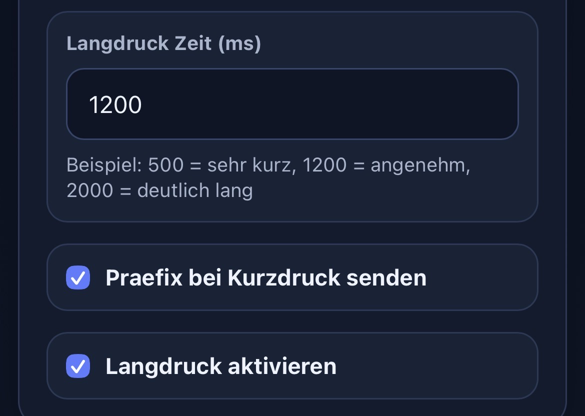

# SmartRace BT Control

ESP32-Firmware, die sechs physische Tasten als Bluetooth-Tastatur bereitstellt.
Das Geraet startet einen eigenen WLAN-Access-Point und bietet eine Weboberflaeche zur Laufzeitkonfiguration.

## Uebersicht


## Funktionen

- Bluetooth-Tastatur-Emulation mit ESP32 BLE Keyboard
- 6 Tasten-Eingaenge mit Entprellung sowie Kurz-/Langdruck-Logik
- Konfigurierbares Tasten-Mapping ueber die Weboberflaeche
- Schaltbare Optionen in der Weboberflaeche:
  - Praefix bei Kurzdruck senden (ein/aus)
  - Praefix nur einmal senden bis Langdruck erfolgt (ein/aus)
  - Batteriemodus (ein/aus, schaltet WLAN nach 60 Sekunden ab)
- WiFi-Manager fuer WLAN-Client (STA): Speichern, Verbinden, Trennen, Scan
- Eigene System-Info-Seite mit Laufzeit-/Netzwerkdaten
- Anzeige der letzten 20 Firmware-Logs in der Weboberflaeche
- Neues Sidebar-Dashboard-Layout mit getrennten Seiten:
  - Overview
  - WiFi Setup
  - System Info
- Speicherung der Konfiguration im NVS (Preferences)
- BLE-Bond-Reset ueber die Weboberflaeche
- Lokaler Setup-AP mit WPA2:
  - SSID: SmartRace-Setup
  - Passwort: 12345678

## Hardware

- Board: ESP32-S3 DevKitC-1 N16R8
- Flash / PSRAM: 16 MB Flash / 8 MB PSRAM
- Framework: Arduino (PlatformIO)
- Status-LED: GPIO 2
- Tasten (active LOW, INPUT_PULLUP):
  - Taste 1: GPIO 4
  - Taste 2: GPIO 5
  - Taste 3: GPIO 6
  - Taste 4: GPIO 7
  - Taste 5: GPIO 15
  - Taste 6: GPIO 16

Jede Taste zwischen den jeweiligen GPIO-Pin und GND anschliessen.

Hinweis fuer ESP32-S3: GPIOs fuer Flash/PSRAM (z. B. 26-33) nicht als Tastenpins verwenden.


## Build und Upload

### Voraussetzungen

- VS Code mit PlatformIO-Erweiterung
- USB-Verbindung zum ESP32-S3 DevKitC-1

### Build

```bash
platformio run
```

### Upload

```bash
platformio run --target upload
```

### Serieller Monitor

```bash
platformio device monitor --baud 115200
```

## Web-Setup

1. ESP32 einschalten.
2. Mit dem WLAN SmartRace-Setup verbinden (Passwort 12345678).
3. Im Browser http://192.168.4.1 oeffnen.
4. In der Sidebar "Overview" oeffnen und konfigurieren:
   - Bluetooth-Name
   - Kurzdruck-Praefix
   - Verzoegerung nach Praefix
  - Option: Praefix bei Kurzdruck senden
  - Option: Praefix nur einmal senden bis Langdruck erfolgt
   - Langdruck-Taste und Langdruck-Zeit
   - **Batteriemodus aktivieren/deaktivieren** (Button in diesem Abschnitt)
   - Tasten fuer Button 1 bis 6
5. In der Sidebar "WiFi Setup" WLAN-Client (STA) konfigurieren:
  - SSID + Passwort speichern
  - Direkt verbinden / trennen
  - Netzwerk-Scan anzeigen
6. Ueber die Weboberflaeche speichern und neu starten.

Die Seite "System Info" zeigt Chip-/Speicherwerte, Netzwerkstatus und die letzten 20 Logs.

Service-Aktionen (Neustart, Bonds loeschen) sind in der UI als POST-Aktionen umgesetzt.

## Screenshots

### Startseite


### Konfiguration


### Neue Optionen: Praefix und Langdruck



### Speichern und Service


## Laufzeitverhalten

- LED leuchtet dauerhaft, wenn BLE verbunden ist.
- LED blinkt, wenn keine BLE-Verbindung besteht.
- Kurzdruck sendet die zugeordnete Taste.
- Wenn Praefix bei Kurzdruck aktiv ist, wird zuerst das Praefix gesendet, dann nach der eingestellten Verzoegerung die Taste.
- Wenn "Praefix nur einmal senden" aktiv ist, wird das Praefix beim ersten Kurzdruck (z. B. Taste 1) gesendet und bleibt danach fuer alle Tasten gesperrt, bis ein Langdruck erfolgt.
- Langdruck ist immer aktiv und sendet die global konfigurierte Langdruck-Taste.
- Wenn Batteriemodus aktiviert ist, schaltet sich das WLAN nach 60 Sekunden automatisch ab (Bluetooth bleibt aktiv). Das WLAN kann jederzeit manuell ueber den Batteriemodus-Button wieder aktiviert werden.

## Projektstruktur

- include: oeffentliche Header-Dateien
- src: Firmware-Implementierung
- test: Platzhalter fuer Tests
- platformio.ini: Board-/Toolchain-Konfiguration

## Changelog

### 2026-03-27

- Hardware-Migration auf ESP32-S3 DevKitC-1 N16R8.
- PlatformIO-Umgebung in [platformio.ini](platformio.ini) auf ESP32-S3 angepasst.
- Board-Speicherkonfiguration auf 16 MB Flash / 8 MB PSRAM eingestellt.
- Partitionstabelle auf `default_16MB.csv` umgestellt.
- Boot-Stabilitaet verbessert (WDT-Safe-Startpfad).
- GPIO-Belegung fuer ESP32-S3 auf sichere Pins angepasst.
- WiFi-Manager eingebaut (STA speichern/verbinden/trennen/scan).
- Neue Seite "System Info" eingebaut.
- Log-Ringpuffer eingebaut und Anzeige der letzten 20 Logs im Webinterface.
- Webinterface auf Sidebar-Dashboard mit separater WiFi-Setup-Seite umgebaut.

### 2026-03-23

- **Neu (Prefix-Once + Langdruck immer aktiv):**
  - Option "Praefix nur einmal senden bis Langdruck erfolgt" hinzugefuegt.
  - Verhalten: Nach erstem Praefix senden alle Tasten nur noch ihre Nummer, bis ein Langdruck erfolgt.
  - Option zum Deaktivieren von Langdruck entfernt (Langdruck ist jetzt immer aktiv).
- **Batteriemodus implementiert:**
  - Automatischer Shutdown des WLAN nach 60 Sekunden
  - Bluetooth bleibt aktiv fuer Tastatureingaben
  - Toggle-Button im Abschnitt "Allgemein"
  - Daueraktivierung moglich zum Nachweis des AP
- Webinterface um neue Schalter erweitert:
  - Praefix bei Kurzdruck senden (ein/aus)
  - Praefix nur einmal senden bis Langdruck erfolgt (ein/aus)
  - Batteriemodus aktivieren/deaktivieren
- Button-Logik angepasst fuer deaktivierbares Praefix und einmaliges Praefix bis zum naechsten Langdruck.
- Langdruck-Umschalter aus der Weboberflaeche entfernt (Langdruck ist immer aktiv).
- Setup-AP auf WPA2 umgestellt (Passwort: 12345678).
- Service-Aktionen im Webinterface auf POST umgestellt (Neustart / Bonds loeschen).
- Batteriemodus-Button in Allgemein-Abschnitt verschoben fuer bessere Sichtbarkeit.
- README erweitert und auf Deutsch aktualisiert.
- Screenshots und Diagramme in README integriert.

## Hinweise

- Das Projekt nutzt auf ESP32-S3 eine 16MB-Partitionstabelle: `default_16MB.csv`.
- Die BLE-Keyboard-Abhaengigkeit wird von PlatformIO ueber dieses Repository aufgeloest:
  https://github.com/T-vK/ESP32-BLE-Keyboard
