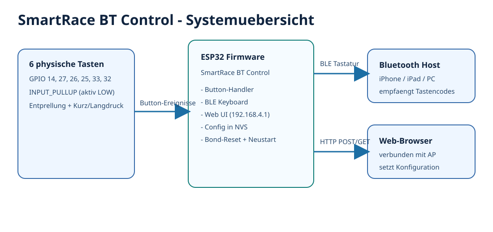
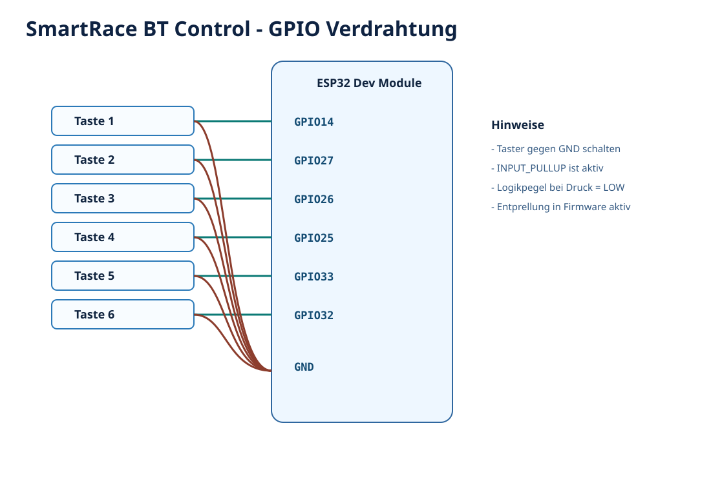
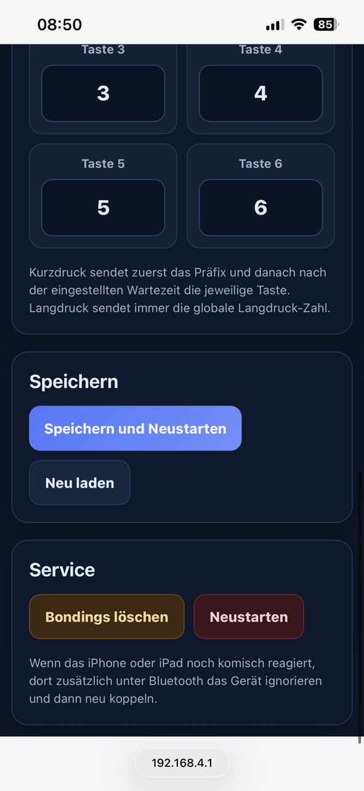
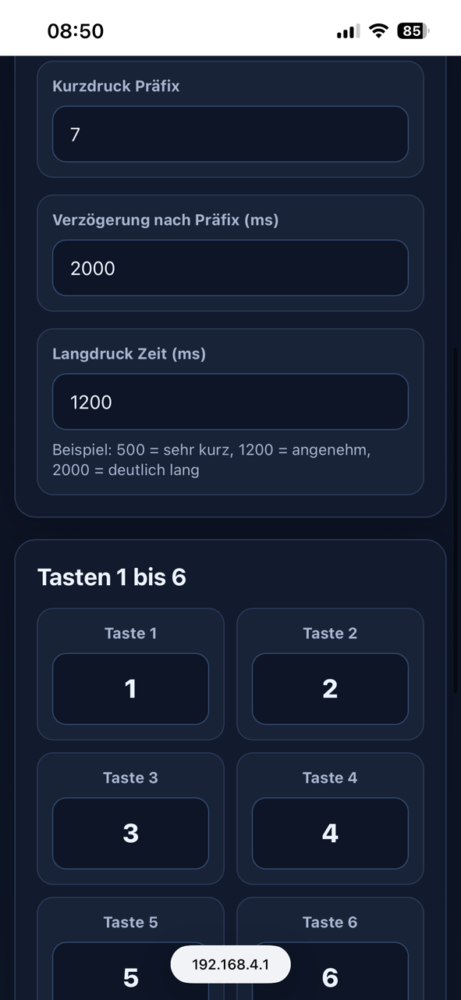
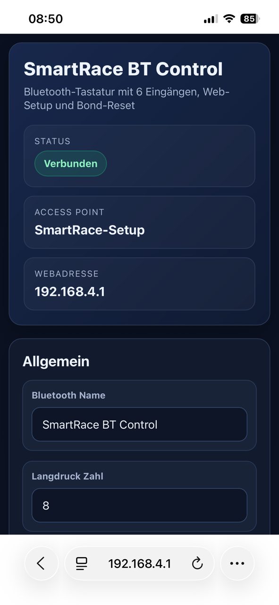

# SmartRace BT Control

ESP32-Firmware, die sechs physische Tasten als Bluetooth-Tastatur bereitstellt.
Das Geraet startet einen eigenen WLAN-Access-Point und bietet eine Weboberflaeche zur Laufzeitkonfiguration.

## Uebersicht



## Funktionen

- Bluetooth-Tastatur-Emulation mit ESP32 BLE Keyboard
- 6 Tasten-Eingaenge mit Entprellung sowie Kurz-/Langdruck-Logik
- Konfigurierbares Tasten-Mapping ueber die Weboberflaeche
- Speicherung der Konfiguration im NVS (Preferences)
- BLE-Bond-Reset ueber die Weboberflaeche
- Lokaler Setup-AP mit WPA2:
  - SSID: SmartRace-Setup
  - Passwort: 12345678

## Hardware

- Board: ESP32 Dev Module
- Framework: Arduino (PlatformIO)
- Status-LED: GPIO 2
- Tasten (active LOW, INPUT_PULLUP):
  - Taste 1: GPIO 14
  - Taste 2: GPIO 27
  - Taste 3: GPIO 26
  - Taste 4: GPIO 25
  - Taste 5: GPIO 33
  - Taste 6: GPIO 32

Jede Taste zwischen den jeweiligen GPIO-Pin und GND anschliessen.



## Build und Upload

### Voraussetzungen

- VS Code mit PlatformIO-Erweiterung
- USB-Verbindung zum ESP32

### Build

```bash
platformio run
```

### Upload

```bash
platformio run --target upload
```

### Serieller Monitor

```bash
platformio device monitor --baud 115200
```

## Web-Setup

1. ESP32 einschalten.
2. Mit dem WLAN SmartRace-Setup verbinden (Passwort 12345678).
3. Im Browser http://192.168.4.1 oeffnen.
4. Konfigurieren:
   - Bluetooth-Name
   - Kurzdruck-Praefix
   - Verzoegerung nach Praefix
   - Langdruck-Taste und Langdruck-Zeit
   - Tasten fuer Button 1 bis 6
5. Ueber die Weboberflaeche speichern und neu starten.

Service-Aktionen (Neustart, Bonds loeschen) sind in der UI als POST-Aktionen umgesetzt.

## Screenshots

### Startseite



### Konfiguration



### Speichern und Service



## Laufzeitverhalten

- LED leuchtet dauerhaft, wenn BLE verbunden ist.
- LED blinkt, wenn keine BLE-Verbindung besteht.
- Kurzdruck sendet erst das Praefix, wartet die konfigurierte Zeit und sendet dann die zugeordnete Taste.
- Langdruck sendet die global konfigurierte Langdruck-Taste.

## Projektstruktur

- include: oeffentliche Header-Dateien
- src: Firmware-Implementierung
- test: Platzhalter fuer Tests
- platformio.ini: Board-/Toolchain-Konfiguration

## Hinweise

- Das Projekt nutzt eine benutzerdefinierte Partitionseinstellung: huge_app.csv.
- Die BLE-Keyboard-Abhaengigkeit wird von PlatformIO ueber dieses Repository aufgeloest:
  https://github.com/T-vK/ESP32-BLE-Keyboard
